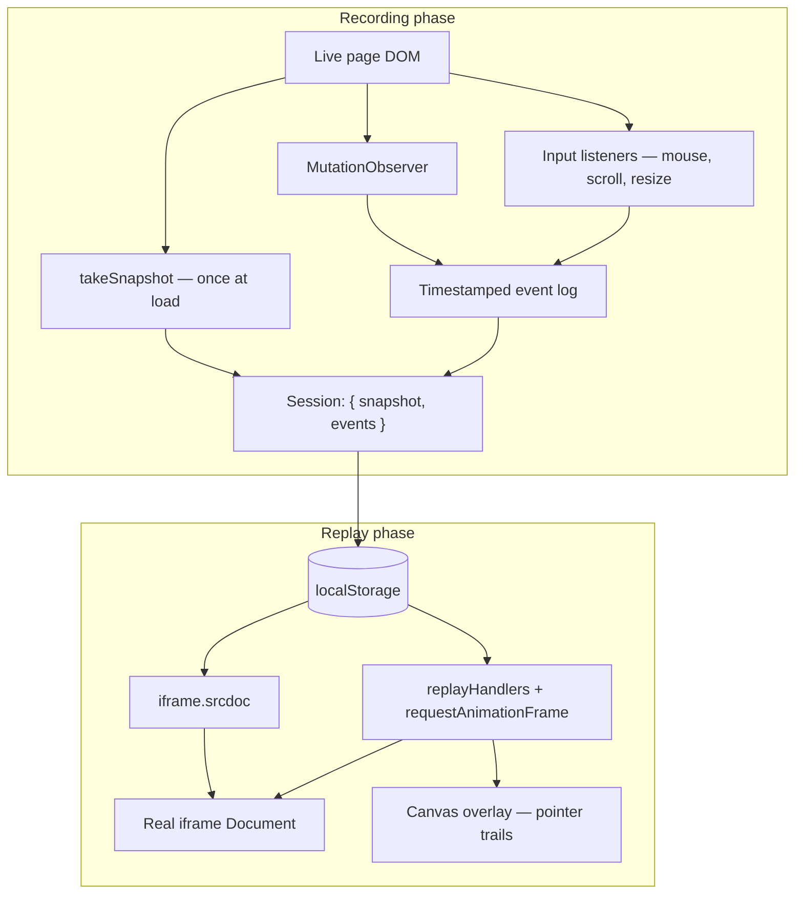

# Native Session Replay

A self-contained session recorder and player implemented in a single HTML file. It captures user interactions and DOM changes using standard browser APIs, persists sessions as plain JSON, and replays them inside a real document—without third-party SDKs, build tooling, or replay libraries such as [rrweb](https://github.com/rrweb-io/rrweb).

Open [`index.html`](index.html) in any modern browser to record, save, and replay interactions locally.

---

## Overview

Commercial session-replay products (Hotjar, FullStory, LogRocket, and others) typically inject a vendor script that serializes the page into a proprietary event stream, then reconstructs the session inside a dedicated replay player—often powered by rrweb under the hood.

This project takes a different approach. It records **one DOM snapshot** at session start and a **compact, application-defined event log** for everything that changes afterward. On replay, it mounts that snapshot in an `<iframe>` via `srcdoc` and applies events with direct DOM APIs. Pointer movement is rendered on a native `<canvas>` overlay.

The result is a fully inspectable pipeline: what you record is what you store, and what you store is what you replay—using the same platform primitives your application already relies on.

---

## Advantages

### Full ownership and transparency

You control the recording format, event types, and replay logic. There is no opaque vendor bundle, no generated replay artifact, and no dependency on a library’s internal serialization schema. Every line of recording and playback code lives in `index.html` and can be read, modified, or extended.

### Zero external dependencies

The implementation uses only built-in browser APIs:

| API | Role |
|---|---|
| `MutationObserver` | Incremental DOM change capture |
| `cloneNode` / `innerHTML` | Initial page snapshot |
| DOM event listeners | Mouse, scroll, and resize input |
| `iframe.srcdoc` | Replay surface with a real `Document` |
| `CanvasRenderingContext2D` | Pointer trail visualization |
| `localStorage` | Session persistence |
| `requestAnimationFrame` | Playback timing and input throttling |

No npm packages, no bundler, no CDN scripts, and no separate replay application.

### Real DOM replay, not a mirror layer

rrweb-based tools rebuild the page inside a synthetic mirror DOM managed by the replay library. Here, replay operates on an actual iframe document. Mutations are applied with familiar methods—`insertBefore`, `remove`, `setAttribute`, scroll property updates—via `nodeAt(doc, path)` and `replayHandlers`. The replayed page is HTML in a browser context, not a deserialized representation maintained by a third party.

### Compact, human-readable session data

Sessions are stored as JSON with two fields: `snapshot` (HTML + viewport dimensions) and `events` (timestamped actions). Event payloads are small and purpose-built (`mut`, `mm`, `dr`, `sc`, …) rather than a verbose, library-specific event stream designed to handle every edge case in the web platform.

This makes sessions easy to debug, diff, filter, or post-process without specialized tooling.

### Predictable performance characteristics

Recording cost is bounded by design:

- **One snapshot** at load, not continuous full-page captures.
- **Incremental mutations** only when the DOM actually changes.
- **Mouse moves** throttled to one event per animation frame.

You are not paying the overhead of a general-purpose replay engine serializing styles, iframes, and canvas content on every tick.

### Privacy and data locality by default

Sessions are written to `localStorage` on the client. Nothing is sent to a third-party server unless you add that yourself. Elements marked `data-no-record` are excluded from the snapshot and ignored during capture, giving you a simple mechanism to keep controls and sensitive UI out of recordings.

### Extensibility without vendor constraints

Need a new event type, a different storage backend, or custom scrubbing behavior? Extend `record()`, add a handler in `replayHandlers`, and ship. You are not waiting on a vendor roadmap or working around rrweb’s event model.

---

## Comparison with rrweb-based replay

| Dimension | Native session replay | Typical rrweb / Hotjar-style stack |
|---|---|---|
| **Footprint** | Single HTML file (~430 lines) | SDK + replay library (often hundreds of KB) |
| **Session format** | Plain JSON: `{ snapshot, events }` | rrweb event stream (full + incremental snapshots) |
| **Replay surface** | Real HTML in an iframe (`srcdoc`) | Mirror DOM inside rrweb-replay player |
| **DOM updates** | Direct API calls on iframe document | Deserialization into synthetic DOM |
| **Pointer visualization** | Separate canvas overlay | Player UI or embedded in snapshots |
| **Customization** | Edit handlers in place | Constrained by library APIs and event types |
| **Platform coverage** | Focused subset (by design) | Broad (cross-origin iframes, shadow DOM, etc.) |

rrweb excels at breadth: it aims to faithfully record arbitrary web applications across many edge cases. This project trades that breadth for **simplicity, control, and a direct mapping between live DOM and replayed DOM**—a deliberate choice when you need a lightweight, auditable solution rather than a full product-grade recorder.

---

## Architecture



**Recording** captures structural state once, then logs deltas and input over time.

**Replay** remounts the snapshot, reapplies events up to the current timestamp, and draws pointer trails on a canvas layer above the iframe. DOM mutations and pointer graphics are intentionally separated: trails are not baked into the saved HTML.

---

## How it works

### Recording

**1. Initial snapshot**

At page load, the recorder clones `document.body`, removes nodes marked `data-no-record` (toolbar, replay overlay), and stores the HTML together with `document.head` and viewport dimensions.

```javascript
function takeSnapshot() {
  const body = document.body.cloneNode(true);
  body.querySelectorAll('[data-no-record]').forEach((el) => el.remove());
  return { html: body.innerHTML, head: document.head.innerHTML, w: innerWidth, h: innerHeight };
}
```

**2. Incremental DOM mutations**

A `MutationObserver` on `document.body` watches for child-list, attribute, and text changes. Each mutation is stored with a **DOM path**—an array of child indices from `body` to the target element—so replay can locate the correct node without CSS selectors or library-specific node IDs.

**3. Input and layout events**

| Event | Type | Description |
|---|---|---|
| Mouse move | `mm` | Throttled via `requestAnimationFrame` |
| Mouse drag | `dr` | Left-button drawing on non-interactive areas |
| Trail break | `mb` | Separates pointer segments (e.g. mouse leave) |
| Scroll | `sc` | `scrollLeft` / `scrollTop` on target element |
| Resize | `rs` | Viewport width and height |
| Canvas clear | `dc` | Clears replay overlay trails |
| DOM mutation | `mut` | Child, attribute, or text change |

Interactive elements (`button`, `input`, `textarea`, `select`, `a`, `[contenteditable]`) are excluded from drag capture so normal clicks and form interaction continue to work.

### Replay

1. **Mount** — Saved HTML is injected into `#replay-frame` via `srcdoc`, producing a live iframe `Document`.
2. **Apply** — `replayHandlers` maps each event type to a DOM or canvas operation. Scrubbing calls `applyEventsUpTo`, which remounts the snapshot and replays events from `t = 0` to the selected timestamp.
3. **Play** — `requestAnimationFrame` advances playback; the scrub bar and time display stay in sync.

Pointer trails use distinct colors: cyan for movement, red for drag strokes.

---

## Session format

Saved under the key `latestInteraction` in `localStorage`:

```json
{
  "snapshot": {
    "html": "<main>...</main>",
    "head": "<meta ...><style>...</style>",
    "w": 1280,
    "h": 720
  },
  "events": [
    { "t": 12, "type": "mm", "x": 340, "y": 210 },
    { "t": 45, "type": "mut", "kind": "attr", "path": [0, 0], "name": "data-count", "value": "1" },
    { "t": 120, "type": "dr", "x0": 100, "y0": 200, "x1": 150, "y1": 240 }
  ]
}
```

- `t` — Milliseconds elapsed since recording started (`performance.now()`-relative).
- `path` — Child-index path from `body` to the target element.
- `kind` (for `mut`) — `child`, `attr`, or `text`.

The format requires no code generator or vendor toolchain to produce or consume.

---

## Usage

1. Open `index.html` in a browser.
2. Interact with the demo: move the mouse, draw on empty areas (hold left button), click **Click me**, use **Reset** to clear trails.
3. Click **Save interaction** to persist the session to `localStorage`.
4. Click **View latest** to open the replay overlay with play, scrub, and close controls.
5. Click **Clear saved** to remove the stored session.

Add `data-no-record` to any element that should be excluded from snapshots and ignored during event capture.

---

## Scope and limitations

This is a focused reference implementation, not a drop-in replacement for enterprise session-replay platforms. It does **not** handle:

- Cross-origin iframes or shadow DOM
- Canvas, WebGL, or embedded video content
- Computed styles beyond what the initial `innerHTML` snapshot captures
- Network requests, console output, or performance metrics
- Server-side upload or multi-session management

These boundaries are intentional. They keep the codebase small, auditable, and free of the complexity that general-purpose replay engines must carry. For applications where a subset of DOM and input replay is sufficient—and where ownership of the pipeline matters—this approach offers a clear, maintainable foundation.

---

## When to use this approach

**A good fit when you need:**

- A lightweight, self-hosted replay prototype
- Full control over what is recorded and stored
- Plain JSON sessions you can inspect, transform, or pipe to your own backend
- No third-party script on your pages
- A teaching reference for how native replay differs from rrweb

**Consider rrweb or a commercial product when you need:**

- High-fidelity replay across complex SPAs with shadow DOM, nested iframes, and rich media
- Production-grade privacy masking, sampling, and analytics integration out of the box
- A maintained library that tracks evolving browser behavior

---

## License

See repository license. This demo is provided as-is for learning and as a starting point for custom implementations.
